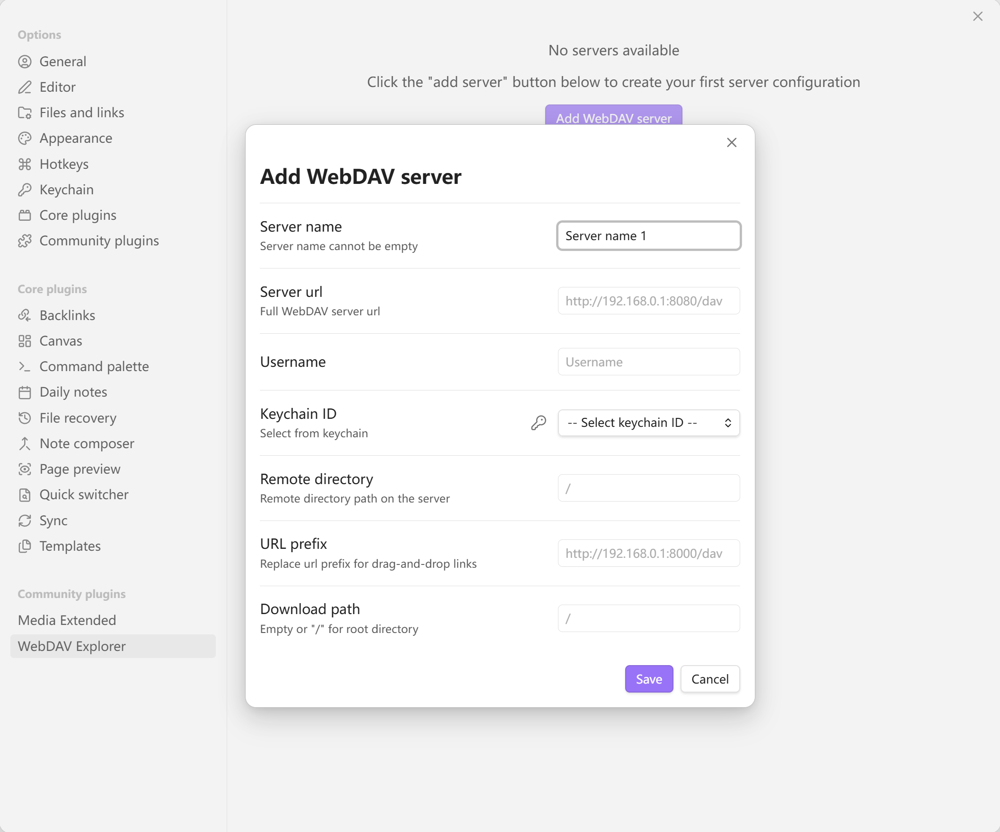

# obsidian-webdav
A WebDAV plugin for generating links by drag-and-drop and opening files by double-click.
##### Settings Example

## Features
##### Browse the files and folders of your Obsidian vault using WebDAV protocol.
##### Pull and drag files into Obsidian to generate links.
##### Preview Mideos and Images Directly (Need plugin: Media extended)
##### Double click to open the file in Obsidian browser.
