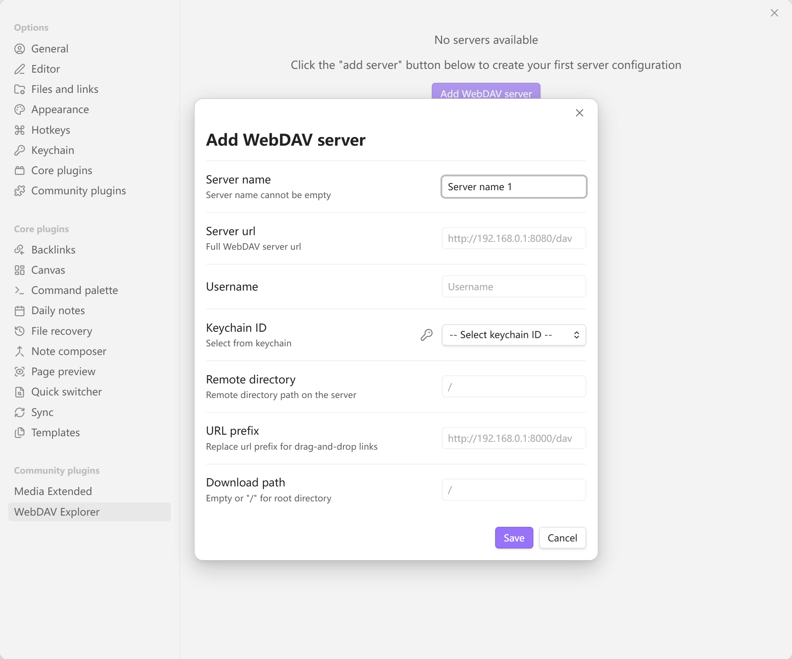

# WebDAV Explorer for Obsidian

    <a href="https://github.com/sunmagicshow/obsidian-webdav/blob/master/README.md">English</a> | <a href="https://github.com/sunmagicshow/obsidian-webdav/blob/master/README_zh.md">中文</a> 

### 📖 Overview
A WebDAV plugin for Obsidian that enables seamless file management through WebDAV protocol. Drag and drop files to generate links, double-click to open files directly in Obsidian!

### ✨ Features

- **📂 WebDAV File Browser** - Access WebDAV servers and browse files and folders
- **🎯 Drag & Drop Link Generation** - Simply drag files into Obsidian to automatically generate markdown links
- **🎬 Media Preview** - Preview videos and images directly within Obsidian (Videos require [Media Extended](obsidian://show-plugin?id=media-extended) plugin)
- **🖱️ Double-click to Open** - Double-click any file to open it in Obsidian's built-in browser
- **⬇️ File Download** - Directly download Obsidian-supported formats to your vault; unsupported formats use the system downloader
- **📤 Right-click Upload** - Right-click on files or folders and select "Upload to WebDAV" to upload to the current browsing path
- **🔄 Duplicate File Handling** - Automatically detects duplicate files during upload, offering options to overwrite, rename, or cancel
- **📁 Folder Batch Upload** - Supports recursive upload of entire folders and their contents, automatically calculates upload results

### ⚙️ Settings Example

### 📋 Requirements

#### 🌐 CORS Configuration
💡 **Recommended**: For the best real-time file preview experience, it is recommended that your WebDAV server supports CORS (Cross-Origin Resource Sharing). If your server does not support CORS, the plugin will automatically use an alternative approach (authorization + blob mode) to handle file previews.

**Recommended CORS header configuration**:
- `Access-Control-Allow-Origin: *` 
- `Access-Control-Allow-Methods: GET, PROPFIND, OPTIONS, PUT, DELETE`
- `Access-Control-Allow-Headers: Authorization, Content-Type, *`
- `Access-Control-Expose-Headers: Content-Length, Content-Type`

### 🎮 Usage Demo
